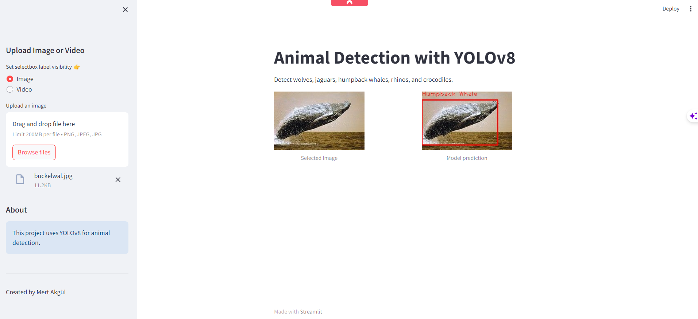

# Animal Detection with YOLOv8


## Description

This project aims to detect five different animals - wolf, jaguar, humpback whale, rhino, and crocodile using the YOLOv8 object detection model.

## Table of Contents

- [Installation](#installation)
- [Usage](#usage)
- [Features](#features)
- [Demo](#demo)
- [Contributing](#contributing)
- [License](#license)

## Installation

To use this project, you need to install the following Python packages:

- opencv-python
- matplotlib
- tqdm
- pybboxes
- ultralytics

You can install these packages using pip:

```bash
pip install opencv-python matplotlib tqdm pybboxes ultralytics
```

## Usage

To utilize the animal detection model, follow these steps:

1. Clone this repository:
   ```bash
   git clone https://github.com/your-username/your-repo-name.git
   ```
2. Navigate to the project directory:
   
   ```bash
  cd AnimalDetection
  ```
3. Launch the Streamlit website:

  ```bash
  streamlit run app.py
  ```
4. Follow the instructions on the Streamlit website to detect animals.


Features
Detection of wolf, jaguar, humpback whale, rhino, and crocodile using YOLOv8.
Easy-to-use interface provided through the Streamlit website.

## Demo


 

   
